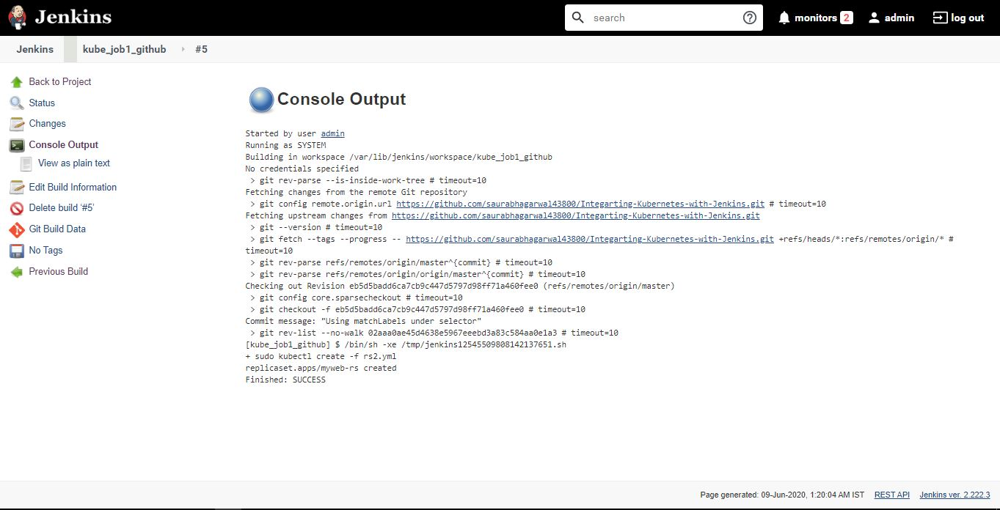
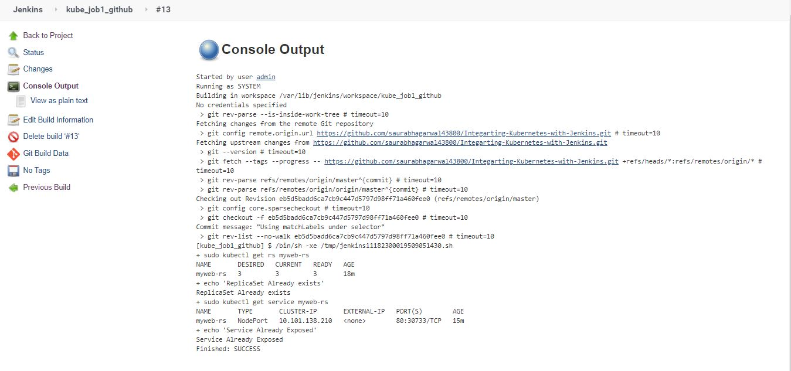

# Integarting-Kubernetes-with-Jenkins
Performing Integration of Kubernetes with Jenkins

__1. Pulling the files from SCM(github)__  

__2. Creating Replica Set in Kubernetes with the yaml file rs2.yml__   

__3. Build Now -> Go to the job -> Console Output -> You can see the job ran successfully__   

__4. Here you can see one replica set "myweb-rs" is created with 3 replicas__  

__5. But if we again try to build the same job, it fails because myweb-rs rs already exists__  

__6. - Write the script using conditionals so that our job will create replication set if it doesn't exist, otherwse shows some message and also expose it to create a service__  

__7. Here you can see one service is created for myweb-rs__  

__8. Now if we try to build the same job again, it fails because the service is already exposed__  

__9. Write the script using conditionals so that our job will create replication set if it doesn't exist, otherwse shows Service Already Exists and also expose it to create a service if it doesn't exist, otherwse shows Service Already Exposed__  

__10. Now if you build the job again you can see our replication set is already exists and service is already exposed message in Console Output__  

